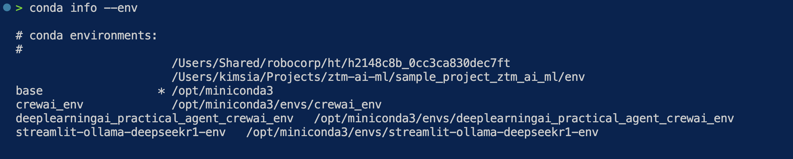
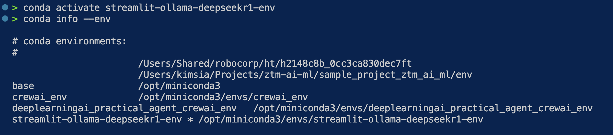

# Install ollama on macOS

1. Go here and [download](https://ollama.com/download/mac)
2. move app to Applicataions
3. double click to run
4. install ollama cli
5. try run `ollama run llama3.2`
   1. expect it to take ~5 mins
6. test to make sure you can [talk with llama3.2](https://www.loom.com/share/2f93c1e710ab4dfbb11c65a00e4280f9)
7. use /? to learn other commands like /bye to quit the chat.

If you're on a different OS, go ollama website to find out the installation instructions.

## Install deepseek r1 7b or 8b

Go [here](https://ollama.com/library/deepseek-r1:8b)

```bash
ollama run deepseek-r1:8b
```

expect it to take ~5 mins

## how to quit the chat in terminal

use `/?` to ask for help on other commands

to quit the chat, it's `/bye`

## how to conda

Name of the conda env we use is `streamlit-ollama-deepseekr1-env`

File that holds the environment is `env.yaml` at root.

I assume you have installed conda. I will not cover conda installation here. Can google.

### how to create new env from env.yaml

```bash
conda env create -f env.yaml
```

### how to activate

```bash
conda activate streamlit-ollama-deepseekr1-env
```

### how to deactivate

```bash
conda deactivate
```


### how to tell which conda env you're in

```bash
conda info --env
```
then see the asterisk is pointing where

By default you're at base.



After you  activate you should see the asterisk change



### how to upgrade python within the env

```bash
conda install python=3.10.16
```

to upgrade to python 3.10.16

### how to export current env to new yaml file

```bash
conda env export > your_chosen_name.yaml
```

you probably don't need this

## streamlit

streamlit is the frontend for your chatbot

### how to run locally

1. turn on your conda env first
2. run `streamlit run streamlit_tutorial.py`

You should see

```bash
  You can now view your Streamlit app in your browser.

  Local URL: http://localhost:8501
  Network URL: http://192.168.1.241:8501
```

## files

`streamlit_tutorial.py` is the exact copy of the full code at the bottom of [streamlit tutorial on building conversational apps](https://docs.streamlit.io/develop/tutorials/llms/build-conversational-apps)

`index.py` is built using `streamlit_tutorial.py` and then prompt claude sonnet for help via cursor.

I use `deepseek-r1:8b` as model. See line 33 at `model="deepseek-r1:8b",  # or any other model you have pulled`

make sure you have

1. install ollama
2. pull the model using the command line `ollama pull deepseek-r1:8b` or whatever model you like. my recommendation is `llama3.2`
3. run the streamlit `streamlit run index.py`

Note: currently, no time to figure out a way to use .env to set the model so the modelname is hardcoded.

## how to change to new model

1. make sure you already install ollama
2. run `ollama pull <new model>`
3. go to index.py and change line 33
4. make sure you turn on the environment `conda activate streamlit-ollama-deepseekr1-env`
5. `streamlit run index.py`

## TODO

- [ ] figure out a way to easily change the model name more easily. perhaps via `.env`